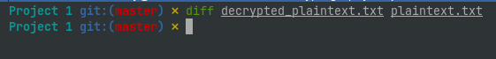
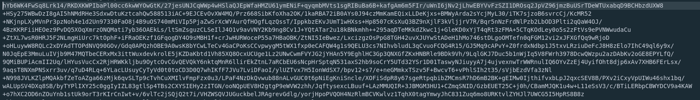

## First project cryptography by Edouard Bettignies Masi-M1
### Implementation of AES-CBC-256 and AES-CTR-256 manually

##### How to run the program and global comprehension

To run the code, you just need to import the pycryptodome library with the following command :
```bash
sudo apt install python3-pip
pip install pycryptodome
```

Before start the program, be sure to have the plaintext file in your current working directory of your jupiter Notebook.

When you run the program, you can choose between 4 cipher :
1. CBC manually cipher
2. CTR manually cipher
3. CBC library cipher
4. CTR library cipher


After you choose your cipher, the program will read your plaintext.txt file in your current working directory.
This plaintext file will be encrypted with the cipher algorithm you choose. 
Then, he will create a ciphertext.txt file.

When the ciphertext.txt file is created, the program will read the file in your current working directory.
Then, he will decrypt it and create a decrypted_plaintext.txt.

You can compare the decrypted file and the original plaintext file with a diff command like this :
```bash
diff <file1> <file2>
```
When I make this command on my laptop, you see that the two files are identical.


Normally, you will see nothing because the two files are identicals.

##### How i set up the key and IV ?

I set up the key and the iv with the get_random_bytes method provide by pycryptodome.
To use this fonctionnality, you input this command in your jupiter notebook file :
```python
key = get_random_bytes(32)
iv = get_random_bytes(16)
```
Why we use the parameters 32 for key and 16 for iv ?

Because we need a 32 bytes length, so 256 bits length, to perform the AES-256 encryption.
For the iv, we need a 16 bytes, so 128 bits length, because we need to have the same length as AES block (16 bytes).


##### How do i encode the message ?

When I read a file, I read it directly from bytes with the "rb" option in python.
When I create the ciphertext file, I encode it in utf-8 with "wb" with a base 64 encoding to have a clean opening when we want to consult the encrypted file.
When I create the decrypted_plaintext file, I write directly into strings because I unpad and decode in utf-8/base64 the cipher text before writing in the file.

The encoding looks like this :


##### How long it takes with the manual implementations and the library implementations ?

*AES-CBC-Manual*

For the encryption and decryption, we respectively obtain more or less 3.2/3.2 seconds for the first time and 1.6/1.7 seconds for the others iterations.

*AES-CBC-Library*

For the encryption and decryption, we obtain more or less 0.005 seconds.

*AES-CTR-Manual*

For the encryption and decryption, we obtain more or less 2.2 seconds.

*AES-CTR-Library*

For the encryption and decryption, we obtain more or less 0.003 seconds.

We can see that the libraries provided by pycryptodome are much faster than the manual implementation.
Moreover, in my manual implementation, I see that ctr is a little bit lower than cbc.


